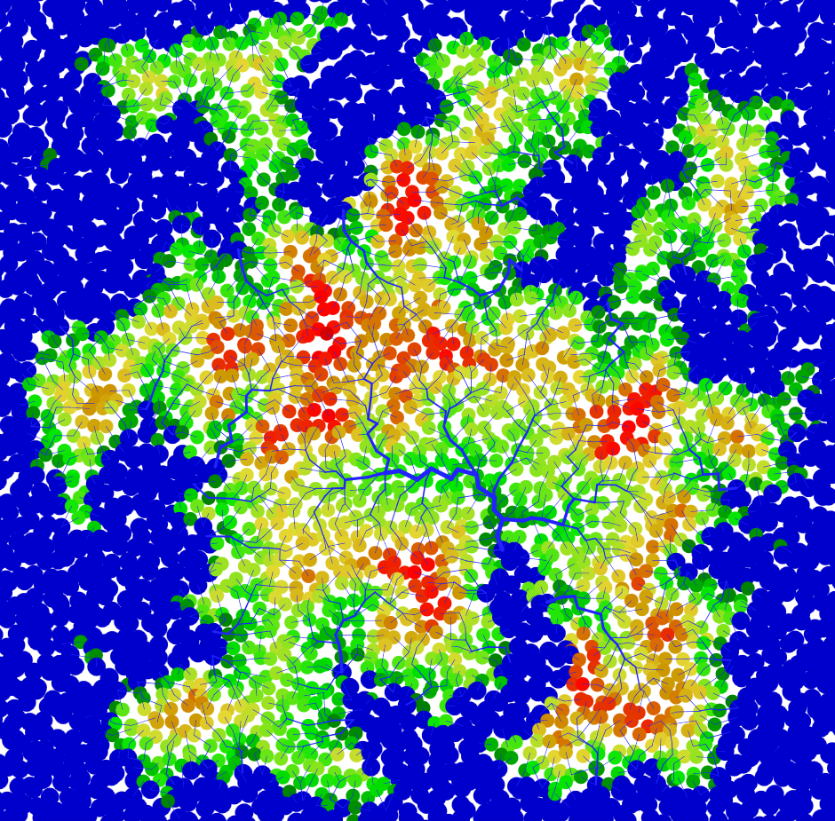
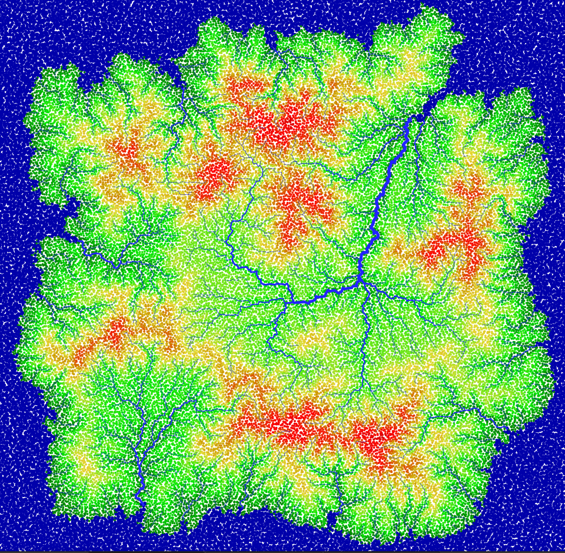
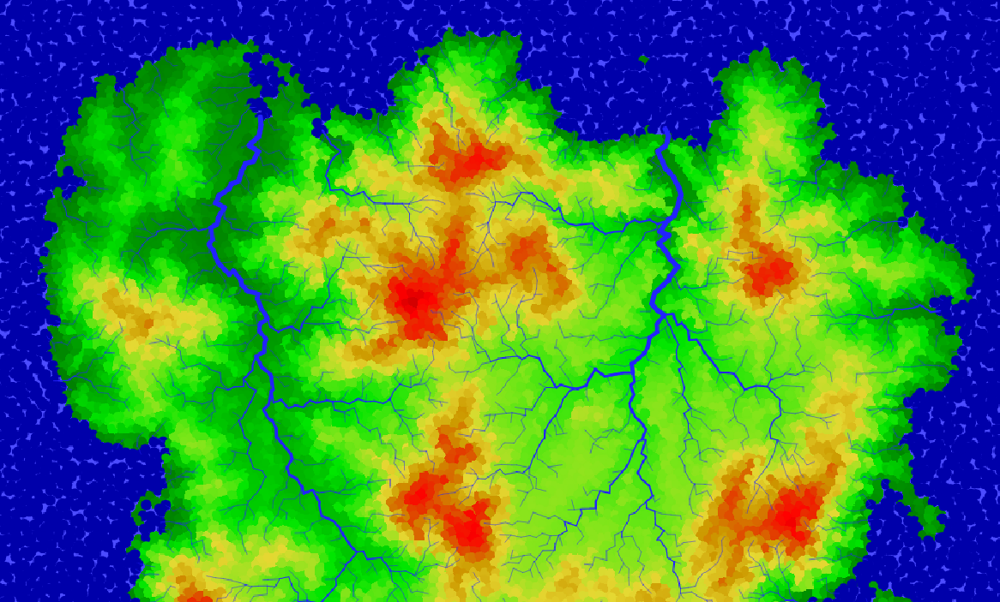
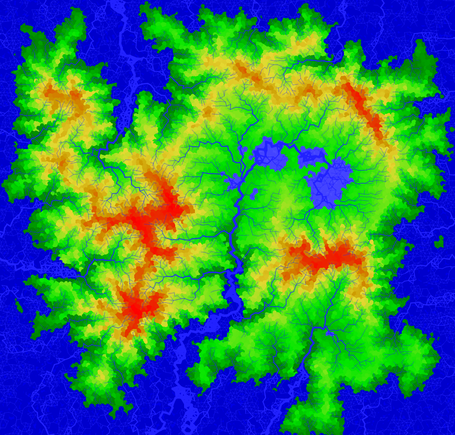

# Elaborate

[Run online](https://troido.nl/elaborate)

Procedural map generation experiment.

Time complexity: `O(n*log(n)*i)` where `n` is the number of nodes (approximately `(size / nodeSize) ^2`) and `i` is the number of erosion iterations.

# Screenshots

